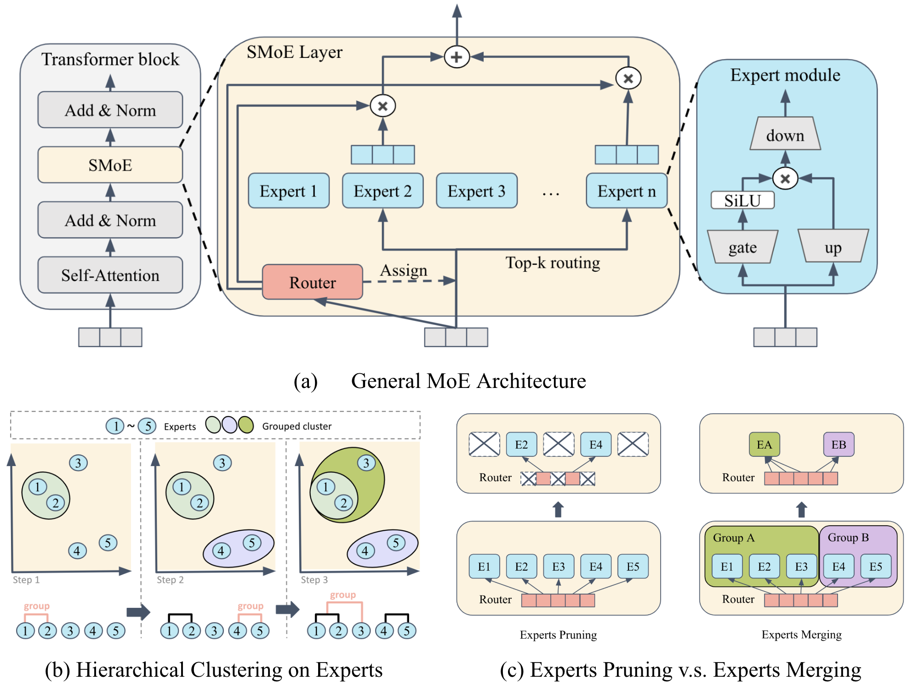

# Retraining-Free Merging of Sparse Mixture-of-Experts via Hierarchical Clustering

[](https://arxiv.org/abs/2410.08589)

In this work, we propose HC-SMoE (Hierarchical Clustering for Sparsely activated Mixture of Experts), a task-agnostic expert merging framework that reduces SMoE model parameters without retraining. Unlike previous methods, HC-SMoE employs hierarchical clustering based on expert outputs, ensuring that the merging process is unaffected by routing decisions. This output-based clustering strategy captures functional similarities between experts, offering an adaptable solution for models with numerous experts. We validate our approach through extensive experiments on eight zero-shot language tasks and demonstrate its effectiveness in large-scale SMoE models like Qwen and Mixtral. Our results show that HC-SMoE consistently achieves strong performance, highlighting its potential for real-world deployment.



## Helper Scripts Quick Reference

One-line reference for data download, model conversion, merge runs, evaluation, and push to HuggingFace. All commands assume you are in the **repo root**. For full options see [scripts/README.md](./scripts/README.md) and [experiment/README.md](./experiment/README.md).

| What | Command |
|------|--------|
| **Data: C4 calibration** | `bash experiment/download_c4.sh` — downloads C4 to `hcsmoe/data/`. Optional: `NUM=512 bash experiment/download_c4.sh` |
| **Model: Mixtral → SDPA (no flash-attn)** | `bash scripts/run_convert_mixtral_sdpa.sh` — download + convert to loadable-without-flash-attn. Output default: `/mnt/scratch/model_zoo/Mixtral-8x7B-v0.1-sdpa` |
| **Model: convert only (no re-download)** | `FROM_LOCAL=/path/to/Mixtral bash scripts/run_convert_mixtral_sdpa.sh` |
| **Model: convert + push to HF** | `PUSH_TO_HUB=1 bash scripts/run_convert_mixtral_sdpa.sh` (default repo: `morriszjm/Mixtral-8x7B-v0.1-sdpa`). Requires `huggingface-cli login` |
| **Merge: Mixtral ZipIt** | `NUM_GROUPS=4 bash experiment/mixtral/run_zipit.sh`. Override output: `OUTPUT_BASE=/path bash experiment/mixtral/run_zipit.sh` |
| **Merge: Mixtral debug** | `bash experiment/mixtral/run_debug.sh` — random grouping + uniform average (fast pipeline test) |
| **Merge: Qwen ZipIt / debug** | `NUM_GROUPS=45 bash experiment/qwen/run_zipit.sh`; `bash experiment/qwen/run_debug.sh` |
| **Eval: Winogrande (local dir)** | `bash scripts/run_eval_winogrande.sh /path/to/saved_model` |
| **Eval: Winogrande (HF model ID)** | `bash scripts/run_eval_winogrande.sh morriszjm/Mixtral-8x7B-v0.1-sdpa` |
| **Push merged model to HF** | `python scripts/upload_to_hf.py /path/to/model_dir <username>/repo-name` (optional: `--private`) |

**Cache / env:** To point HuggingFace cache elsewhere (e.g. a large disk):  
`export HF_HOME=/path/to/cache/huggingface` and `export HF_DATASETS_CACHE=$HF_HOME/datasets`.

---

## Updates
- [2025/05/01] :fire: Our paper, **Retraining-Free Merging of Sparse Mixture-of-Experts via Hierarchical Clustering**, has been accepted by **ICML 2025**!

## TODO
- [ ] Release accepted version of the paper.


## Code Description
This repository is written based on the codes in the [GitHub](https://github.com/UNITES-Lab/MC-SMoE).

## Setup
1. Install basic packages. `pip install -r requirements.txt`
2. Install `lm-eval`. [lm-evaluation-harness](https://github.com/EleutherAI/lm-evaluation-harness)


## Dataset Preparation
Please download the C4 training data c4-train.00000-of-01024.json from [allenai/c4](https://huggingface.co/datasets/allenai/c4/blob/main/en/c4-train.00000-of-01024.json.gz).

Then save it to path `hcsmoe/data/c4-train.00000-of-01024.json`.

Or you can assign the path in [hcsmoe/evaluation/minipile.py](./hcsmoe/evaluation/minipile.py).
```python
DATASETS = {
    'c4': lambda: load_dataset('json', data_files={'train': 'hcsmoe/data/c4-train.00000-of-01024.json'}, trust_remote_code=True),
}
```

## Experiments
We provide the code script in `scripts/mixtral/run.sh` and `scripts/qwen/run.sh`. Change the setting in those files. Run the script file as follows.

For detailed description for each argument, please see [here](./scripts/README.md).
```
bash scripts/mixtral/run.sh
bash scripts/qwen/run.sh
```

## Citation
```
@misc{chen2025hcsmoe,
      title={Retraining-Free Merging of Sparse MoE via Hierarchical Clustering}, 
      author={I-Chun Chen and Hsu-Shen Liu and Wei-Fang Sun and Chen-Hao Chao and Yen-Chang Hsu and Chun-Yi Lee},
      year={2025},
      booktitle={International Conference on Machine Learning (ICML)}
}
```